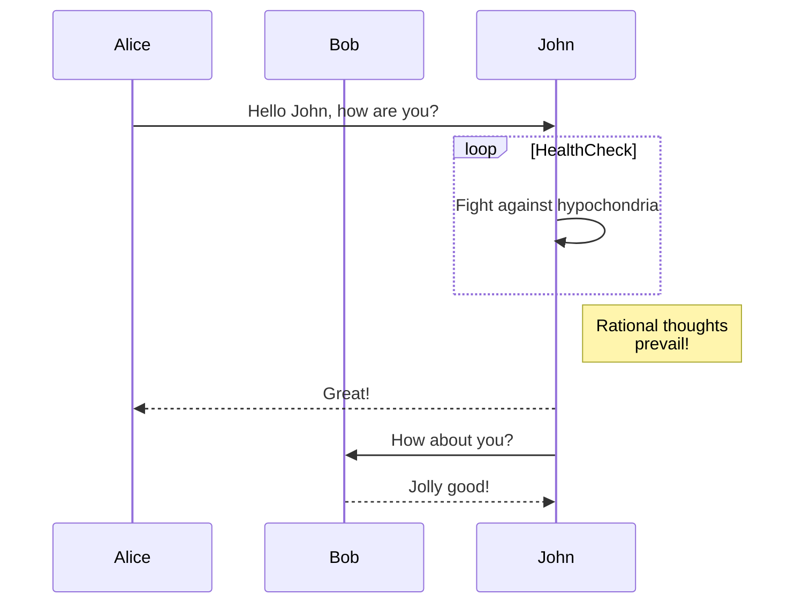
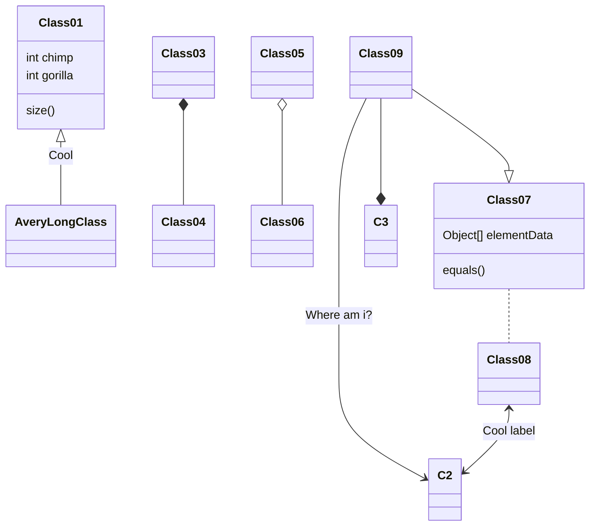

## Usage

```ts
// _config.ts

import lume from "lume/mod.ts";
import mermaid from "https://deno.land/x/lume_mermaid@v0.1.3/mod.ts";

const site = lume();

site.use(mermaid({
  theme: "dark",
  config: {
    startOnLoad: true,
    themeVariables: {
      primaryColor: "#ff69b4",
      edgeLabelBackground: "#222",
      background: "#111",
    },
  },
}));

export default site;
```

Change the version from **v0.1.3** to the latest version in [https://deno.land/x/lume_mermaid](https://deno.land/x/lume_mermaid).

### Options

```ts
export interface Options {
  /**
   * CSS selector to find mermaid code blocks.
   * Default: "pre code.language-mermaid"
   */
  cssSelector?: string;

  /**
   * Whether to inject Mermaid.js automatically
   */
  injectScript?: boolean;

  /**
   * Mermaid.js CDN URL
   */
  mermaidJsUrl?: string;

  /**
   * Built-in Mermaid theme: "default" | "dark" | "forest" | "neutral"
   */
  theme?: "default" | "dark" | "forest" | "neutral";

  /**
   * Custom Mermaid config (merged into the default config)
   */
  config?: Record<string, unknown>;
}
```

## Examples

Here are some examples, but you should definitely check out the [Mermaid documentation](https://mermaid.js.org/) for more details.

### Flowchart

````markdown

````


### Sequence Diagram

````markdown

````


### Class Diagram

````markdown

````


